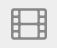
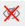

<!-- TODO:
- replace above image
- update title and/or file name?
-->

## Introduction

## Understanding the existing menu
For each button in the menu, I read the text contained in its hover tooltip, and the description of its intended functionality in the extension's documentation.

Some terminology:
Permanent: the setting will be preserved until it is disabled
Temporary: the setting will be preseved until the page is reloaded

| Icon                                                                                                                                                             | Tooltip                                                                                            | Functionality                                                                                                                                                                                            |
|------------------------------------------------------------------------------------------------------------------------------------------------------------------|----------------------------------------------------------------------------------------------------|----------------------------------------------------------------------------------------------------------------------------------------------------------------------------------------------------------|
|                                                        | Click to disable [ad blocker] for this site. Ctrl+click to disable [ad blocker] only on this page. | Clicking this button will permanently turn off the extension for the current site. Pressing the ctrl or cmd key while clicking this button will permanently turn off the extension for the current page. |
|                                                                              | Enter element zapper mode                                                                          | Clicking this button will activate element zapper mode. While in this mode, clicking on page elements will temporarily remove it from the page.                                                          |
|                                                                              | Enter element picker mode                                                                          | Clicking this button will open an interactive menu for creating filters which can permanently remove elements from the site.                                                                             |
|                        | Open the logger                                                                                    | Clicking this button will open a logger, which details technical details about what the extension is doing.                                                                                              |
|                                            | Open the dashboard                                                                                 | Clicking this button will open the dashboard, where you can edit various extension settings and preferences.                                                                                             |
|  | Click to block all popups on this site                                                             | Clicking this button will permanently block all pop-ups for the site.                                                                                                                                    |
|                                             | Click to block large media elements on this site                                                   | Clicking this button will permanently block large media from loading on the site.                                                                                                                        |
|    | Click to disable cosmetic filtering on this site                                                   | Clicking this button will permanently display removed elements for the site.                                                                                                                             |
|                                                      | Click to block remote fonts on this site                                                           | Clicking this button will permanently block remote fonts from loading on the site.                                                                                                                       |
|                                                                                          | Click to disable JavaScript on this site                                                           | Clicking this button will permanently disables JavaScript on the site.                                                                                                                                   |

## Identifying the problems

### Iconography
Many of the icons are unclear

Several icons look similar to each other:
- Sliders, logger, settings, film strip

The small icon size and no clear label makes them even harder to distinguish.

Familiar icons being re-used for other purposes:
- 'Copy'
- '(color) picker'
- 'thunderbolt'
- HTML

Bottom row icons get crossed with red x when activated. Double crossing out eye:
<!--

-->

### Tooltips
Takes several seconds to display the tooltip text, which is not always helpful on its own.
Accessibility issues.

### Complex controls
- Unclear which settings take priority over others
- Unclear which settings are tools vs. site-specific
- Extra information in the middle (requests blocked, domains connected) necessary? Can they be smaller?
- Even after spending time reading documentation, still don't totally understand.

## Applying the solutions
- Presume all functionality and information in the existing menu is actually important and required
- Group and label related items
- Avoid using similar icons, and icons without text
- Improve text
- Reduce complexity of controls (ctrl/cmd + click)

## Result
[a wireframe/mockup/prototype]
