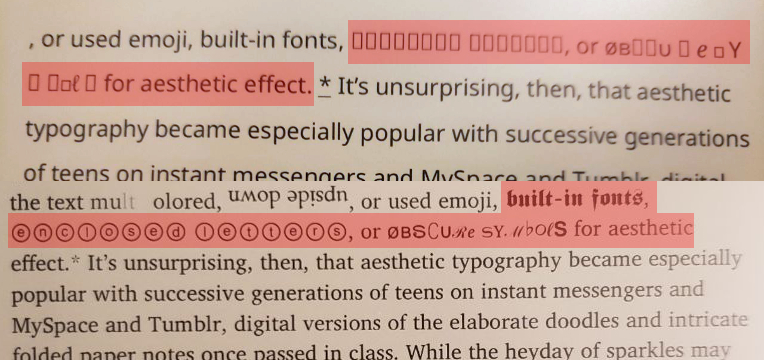
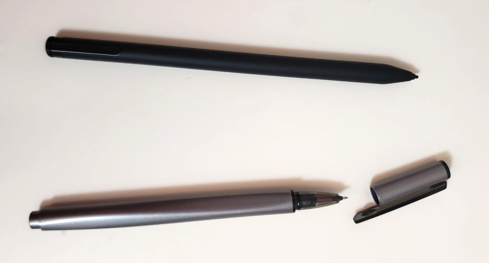

## Introduction

I first learned about these devices when [Shelby Spees](https://twitter.com/shelbyspees) tweeted about annotating PDFs on a reMarkable.

I often found myself printing out pages of PDFs to write on, so this seems like a great device for me. I was also hoping it would replace my [Kobo Aura Edition 2 eReader](https://ca.kobobooks.com/products/kobo-aura), which I found kind of clunky to use.

I did some research, and wasn't able to find a preferred name for this type of device. Some of the names I've seen are: eNote, ePaper, digital note, digital paper, and E Ink tablet.

There are a few of these types of devices out there, but they share some key features:
- E Ink display
- Paper feel
- Limited functionality in comparison with a regular digital tablet (e.g. iPad)
- Surprisingly (to me, anyways) pretty popular among theologists

I was convinced, and purchased a [reMarkable 2](https://remarkable.com/store/remarkable-2) pretty much immediately. After a couple weeks of use, I ended up wishing for more functionality than the device provided. That's when I discovered the [Supernote A5 X](https://www.supernote.com/#/product?type=SN-A5-X). It's a similar device that has more popularity in east Asia.

Overall, I preferred Remarkable 2's hardware and Supernote A5 X's software. They both have pros and cons, and one may be better than the other based what you want to accomplish with it. I was primarily looking for distraction-free reading and note-taking, and ended up choosing the Supernote mainly because of [how much better they handle ePubs](#supported-file-formats) and [annotations](#annotations). They also have a much more responsive team, so I have higher hopes of them adding features I'm missing than for reMarkable.

I've written about some of the features of these 2 devices here. I hope this helps with your purchasing decisions!

## Contents

- [Hardware](#hardware)
  - [Body](#body)
  - [Storage](#storage)
  - [Battery life](#battery-life)
- [Software](#software)
  - [Operating system (OS) and extendability](#operating-system-os-and-extendability)
  - [Customizability](#customizability)
  - [Language support](#language-support)
  - [Supported file formats](#supported-file-formats)
  - [File transfer](#file-transfer)
  - [Annotations](#annotations)
- [Accessories](#accessories)
  - [Pen](#pen)
  - [Cover](#cover)
- [Other](#other)
  - [Price](#price)
  - [Returns](#returns)
  - [Community and customer support](#community-and-customer-support)
  - [Ease of use](#ease-of-use)

### Hardware

#### Body

The reMarkable 2 is a sleek device with a metal spine. I thought it was a nice touch that they chose to match their bezel colour to the screen.

The Supernote A5 X feels like a cheaper device. Supernote claims their screen "never breaks", so it may be a better choice for clumsier folks. Their screen might be a touch glossier than the reMarkable 2. The A5 X has a convenient "slidebar" along the right side of the screen, which can be swiped down to activate a toolbar and swiped up to force refresh the screen.

Both devices are about the same size and weight, although Supernote offers a smaller version of their device, the [Supernote A6 X](https://www.supernote.com/#/product?type=SN-A6-X).

Both devices charge via USB-C, which is pretty convenient for me since I can use the same cable for all of my devices.

#### Storage

The reMarkable 2 comes with 8GB of internal storage, while the A5 X comes with a whopping 32GB of internal storage.

#### Battery life

E Ink displays only require power to change what is shown on the screen, so the battery life should be pretty long. Remarkable claims "up to 2 weeks" of battery life, but I found this to be pretty unrealistic when you have to have the Wi-Fi on most of the time for syncing files. I couldn't find any claims of battery life on Supernote's site, but it does seem to last much longer than the reMarkable 2.

### Software

#### Operating system (OS) and extendability

The reMarkable is Linux-based and the Supernote is Android-based. There are some open-source hacks out there for the reMarkable, but I'd rather not deal with that, especially for basic functionality, and even more especially since it invalidates reMarkable's end-user license agreement (EULA).

Supernote has started adding third-party apps, beginning with Kindle. More apps and developer support are in the works, so I'm hopeful for officially sanctioned extendability through the form of apps.

#### Customizability

The Supernote offers much more customizability built-in, including the ability to add your own:
- Screensaver
- Fonts
- Templates

With the exception of a screensaver image, none of these are currently possible on the reMarkable without hacks.

#### Language support

[The reMarkable supports a long list of handwriting conversion languages, but only 2 keyboard languages](https://support.remarkable.com/hc/en-us/articles/360007012598-Which-languages-do-you-support-), and they are all European languages. You can only choose 1 language for each, so it's not very useful for users who want to write and convert text in multiple languages on the same device.

The Supernote currently only supports 3-4 languages: English, Japanese, Simplified Chinese, and Traditional Chinese. However, you can select multiple keyboards and allow auto-detecting of handwriting language. Handwriting conversion seems to be more reliable in Japanese and Chinese than in English.

I found that non-Roman glyphs that didn't render on the reMarkable 2 did display properly on the Supernote A5 X.

#### Supported file formats

reMarkable claims to support ePub and PDF documents, but what they actually do is convert ePubs to PDF. This is a very slow process, and changing ePub display settings is a huge pain. The table of contents navigation is also slow.

Supernote supports ePub, PDF, and Word documents, as well as PNG and JPG image formats.

#### File transfer

File transfer with the reMarkable is pretty much only possible through their own cloud storage system, the [reMarkable Cloud](https://support.remarkable.com/hc/en-us/articles/360002648297-Connecting-to-the-reMarkable-cloud). I'm pretty sure you can't use the device without at least logging into their cloud. [They are experimenting with USB file transfer](https://support.remarkable.com/hc/en-us/articles/360002661337-Transferring-files-using-a-USB-cable), so it may be easier to file transfer without using their cloud storage in the future. I'm not a security expert, but I would definitely recommend looking into this further if you are concerned about security, and especially if you are working with sensitive documents.

Supernote, on the other hand, offers a variety of file transfer methods, including:
- [Supernote Cloud](https://cloud.supernote.com.cn/#/login)
- [Supernote Partner App](https://play.google.com/store/apps/details?id=com.ratta.supernote)
- [DropBox](https://www.dropbox.com/)
- Email
- USB

I haven't use their cloud storage at all, so I'm not sure how it compares to reMarkable's, which was pretty easy to use.

So far I've been transfering files primarily by USB cable and by sending emails with attachments to an email address I created just for file transfer purposes.

#### Annotations

reMarkable's version of annotations is essentially drawing on a layer on top of PDFs. Supernote's annotations include actual text extraction.

### Accessories

#### Pen

I opted for the [reMarkable 2's Marker Plus](https://remarkable.com/store/remarkable-2/markers), which has a digital eraser on the end for quick erasing. The Marker (not Marker Plus) is more comparable with the [Supernote's Standard Pen](https://www.supernote.com/#/part?id=SP-03) since neither of them have erasers.

The eraser end of the Marker Plus is convenient, but not necessary since it's still possible to erase by switching to the eraser tool through the user interface (UI). If this is an important feature to you, you could try the [LAMY AL-star EMR pen](https://www.supernote.com/#/part?id=SP-05) which has a side-button that activates the eraser tool.

Both pens are battery-less and don't require charging.

The Marker Plus attaches to the reMarkable 2 magnetically. I find this kind of gimmicky, but it is a bit quicker to access over the Supernote's Standard Pen, whose cap hooks onto the case's fabric pen loop. I'm not very confident in either attachment method - it feels like the pens could fall off by accident.

Supernote's Standard Pen feels heavier than the Marker Plus, and has been harder on my hands. It looks more like a regular pen, and has a removable cap. I dislike both of these design choices since I feel like I'll lose the cap and mix it up with a regular pen.

A unique feature of Supernote's Standard Pen is that it is nib-less, so there's no need to buy replacement nibs as they wear out.

I experimented with using the reMarkable's Marker Plus to write on the Supernote A5 X, and found that the writing experience felt a lot more paper-like. I think the ceramic nib moves more smoothly, so it feels more like writing on a digital tablet.

Supernote has a few other pens available, but I think I'll try compatible third-party Electro-Magnetic Resonance (EMR) pens with quality nibs to use with the Supernote A5 X for a more satisfying writing experience.

#### Cover

I opted for the [reMarkable 2's Book Folio with the grey polymer weave material](https://remarkable.com/store/remarkable-2/folios), which is pretty comparable to the [Supernote A5 X's Canvas Folio](https://www.supernote.com/#/part?id=FC).

The reMarkable 2's Book Folio attaches to the device with magnets. As with the pen, it feels gimmicky and I'm not super confident about the attachment strength.

The Supernote A5 X's Canvas Folio attaches to the device using a physical rail. The attachment feels secure.

In terms of the material, I much prefer reMarkable's cover. It feels sturdier and the material feels like it's of a higher quality than Supernote's.

I wish that Supernote's pen loop were made from an elastic material so that different pens could fit snugly in it. As it is, the pen flops around quite a bit, and I'm not confident that the pen won't fall out of the cap which hooks over the fabric pen loop. Using an elasticated loop probably would've avoided [a problem Supernote had with pens they sold not being able to fit into the pen loop](https://supernote.com/#/blog/detail?id=97).

A major plus for me with the Supernote's cover is that it is a sleep cover. That is, the device is put to sleep when the cover is closed, and wakes when the cover is opened.

### Other

#### Price

The pricing of the Supernote and reMarkable are fairly similar, although the Supernote is a bit cheaper.

Supernote offers a convenient Standard Set priced at $499 USD, which includes: the device, a denim blue folio cover, and their Standard Pen. You also have the option of buying them separately. I ended up paying around $800 CAD for the Standard Set, which is including a surprise additional duty fee of about $95 CAD.

The reMarkable device and accessories are all sold separately, so you need to decide which cover and pen you'd like, if any. The Book Folio with the grey polymer weave and the Marker options would be most comparable with Supernote's Standard Set. This combination is priced at $517 USD. I opted for the Marker Plus, and ended up paying $897 CAD.

#### Returns

reMarkable's return policy is pretty generous, with a 30-day satisfaction guarantee. Supernote is only refundable if unopened.

#### Community and customer support

reMarkable's website and social media are, much like their product, sleek. However, I found their support pretty unsubstantial. The community seems to be more technical people.

Supernote has active communities on Facebook and Reddit, which are frequented by Supernote employees that actually respond to posts! The community seems to be friendly. I do think their website and documentation aren't as good as reMarkable's, partly due to inaccessible coding and partly due to translation weirdness.

#### Ease of use

I do think it's much easier/quicker to get up and running with the reMarkable 2, but that may be due to it having fewer and less frequently updated features and options.
