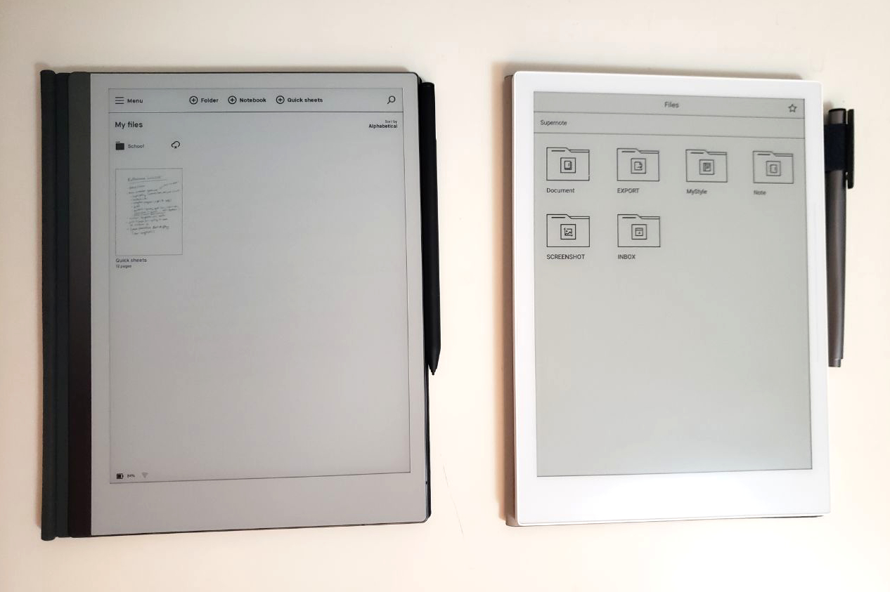
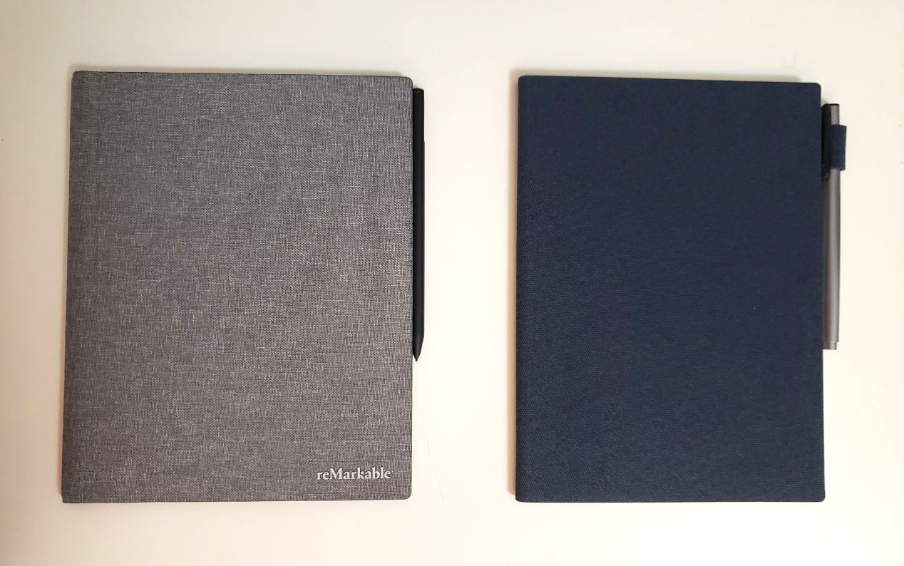

<!--
  TODO: Update frontmatter
-->

## Intro
- Recco view <https://twitter.com/shelbyspees>
- Name? eNote, ePaper, digital paper, e-ink tablet...
- Similarities: paper feel, e-ink display, limitations
- Final decision and why?
- Comparing: Supernote A5 X w/ base packages vs. reMarkable 2 w/ gray polymer weave book folio and marker plus

## Comparison

### Price
- Bundling?
- reMarkable: starting at $517 USD for lowest model pen and cover (sleeve-style folio, not book folio). $597 USD for my bundle.
- Supernote: starting at $499 USD

### OS (Operating System)
- Hackability?
- reMarkable: Linux
- Supernote: Android

### Security
- reMarkable: their cloud
- Supernote: their cloud, dropbox, USB transfer, email*

### Software
- Similarities? File transfer?
- reMarkable:
- Supernote: better ePub support, custom templates, custom fonts, recent files navigation, more colours, annotations, search handwritten notes, doesn't hide writing area, additional formats, kindle support, seems to get more features and updates, kindle

### Hardware
- Both USB-C charging, size and weight similar
- reMarkable: sleek, prefer the gray bezel, more fragile?
- Supernote: cheaper feel, more resilient to falls? side bar functionality, glossier

### Pen
- Feel? Altenatives?
- Neither require batteries
- reMarkable: magnetic, requires replacement nibs, built-in eraser
- Supernote: looks more like pen (bad?), has cap, fits into cover loop, heavier

### Cover
- reMarkable: magnetic
- Supernote: fits with "clip", sleep cover functionality, cheaper feel, pen floppy in loop

