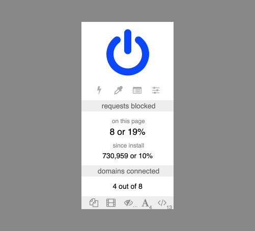
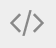

## Introduction
In this case study, I will analyze a UI element of a popular ad blocker browser extension. This case study is based on a real browser extension that I am a former user of. The UI element is a menu that is revealed after clicking the browser extension's icon in the browser's navigation bar.

I was inspired to study this UI element when I realized that I used it infrequently and with great difficulty. My thought was that if I, a web professional, found it difficult to use this menu, most other users must feel the same way.

It turns out that there are some very vocal users who like the menu exactly the way it is. I decided to publish this case study even though my recommendations were not accepted, if only to demonstrate my UX thinking and process.

Enjoy, if you want to!

## Understanding the existing menu
First of all, I set off to understand the existing menu. I found the menu confusing at first glance, and didn't find the tooltips very enlightening. I studied the extension's documentation to help me understand how to use the menu, and have recorded my findings below.

### Structure

Looking at the the image of the menu above, there are 5 distinct areas:

1. **The power button**

  This is the big blue power icon at the top of the menu.

2. **The tools**

  This is the row of 4 icons directly under the power button.

3. **The number of requests blocked**

  This area is labelled 'requests blocked' and shows the number of requests blocked 'on this page' and 'since install' as both a number and a percentage.

4. **The number of domains connected**

  This area is labelled 'domains connected' as a number 'out of' another number.

5. **The per-site switches**

  This is the row of 5 icons at the bottom of the menu. Some of the icons have small numbers or ellipses on their bottom right.

### Functions
I recorded the icon, tooltip text, and functionality for each button in the menu.

| Icon                                                                                                                                              | Tooltip                                                                                            | Functionality                                                                                                                                                                                            |
|---------------------------------------------------------------------------------------------------------------------------------------------------|----------------------------------------------------------------------------------------------------|----------------------------------------------------------------------------------------------------------------------------------------------------------------------------------------------------------|
|                                                        | Click to disable [ad blocker] for this site. Ctrl+click to disable [ad blocker] only on this page. | Clicking this button will permanently turn off the extension for the current site. Pressing the ctrl or cmd key while clicking this button will permanently turn off the extension for the current page. |
|                                                                              | Enter element zapper mode                                                                          | Clicking this button will activate element zapper mode. While in this mode, clicking on page elements will temporarily remove them from the page.                                                        |
|                                                                              | Enter element picker mode                                                                          | Clicking this button will open an interactive menu for creating filters which can permanently remove elements from the site.                                                                             |
|                        | Open the logger                                                                                    | Clicking this button will open a logger, which details technical details about what the extension is doing.                                                                                              |
|                                            | Open the dashboard                                                                                 | Clicking this button will open the dashboard, where you can edit various extension settings and preferences.                                                                                             |
|  | Click to block all popups on this site                                                             | Clicking this button will permanently block all pop-ups for the site.                                                                                                                                    |
|                                             | Click to block large media elements on this site                                                   | Clicking this button will permanently block large media from loading on the site.                                                                                                                        |
|    | Click to disable cosmetic filtering on this site                                                   | Clicking this button will permanently display removed elements for the site.                                                                                                                             |
|                                                      | Click to block remote fonts on this site                                                           | Clicking this button will permanently block remote fonts from loading on the site.                                                                                                                       |
|                                                                                          | Click to disable JavaScript on this site                                                           | Clicking this button will permanently disable JavaScript on the site.                                                                                                                                    |

## Reacting to the existing menu
After understanding the existing menu, I collected my own reaction and the reactions of other users.

### Questions
Studying how the menu works brought up many questions in my mind, which I've recorded below. These questions are mostly left unanswered, but would ideally be further explored through testing and analytics.

#### Is this menu necessary?
- Do most users install the ad blocker extension and leave it as-is, or do they make customizations and use its tools?
- How many users use this menu, and how frequently do they use it?

#### Is all the information in the menu necessary?
- How many users are interested in the 'requests blocked' and 'domains connected' areas of the menu?
- Why are the figures presented in so many different ways?
- Should all the figures be presented in the same format?
- Does this information belong in this menu, or does it belong in another location?

#### Is all the functionality in the menu necessary?
- Which functions do users use most?
- Are there any functions that are missing?

#### Is the menu easily understood?
- Do users unstand the difference between the 2 rows of icons?
- Do users understand what each icon means?
- Is it clear how the power button works with ctrl/cmd and clicking?

### User feedback
Although I did not perform formal user research, I did receive user feedback through informal online discussions. Here I have grouped the feedback into themes.

#### Things that users find useful
- I like seeing the number of requests blocked on the page because I know that the ad blocker has prevented something from loading. It lets me know that the ad blocker is working, and I know that it may be the cause of my problem if the page is not working properly.
- I can use the tooltip to figure out what the buttons do.
- I use the power button to turn off ad blocking for the page. I think I've used the settings button to change my settings.

#### Things that users don't find useful
- I don't know why it would be useful to see the number of requests blocked since I've installed the browser extension.
- I don't know why it would be useful to see the percentage of requests blocked for either the page or since install.
- I don't find the number of domains connected useful. Maybe someone else would find it useful.
- I don't remember ever using this menu.

#### Things that users don't understand
- Several icons could be replaced with more suitable ones.
- The power button looks like a logo.
- I don't know what any of the buttons on this menu do.
- I don't know what the percentage means.

#### Users familiar with the menu are resistant to it changing
- I don't need or want the icons to change because I use them through muscle memory.
- Tens of millions of users, including myself, are familiar with the menu. It is better to keep the menu the same so that existing users don't get confused.

## Issues with the existing menu
Based on my previous experience and the limited user feedback I had available, I've identified the following usability and accessibility issues.

### Confusing iconography
Many of the icons look similar to each other. Their small size, low contrast, and lack of clear labels makes them even harder to distinguish from one another.

Some icons that are typically used for other functions have been reused for unrelated functions. For example, the 2 pages icon represents a ‘copy’ function in many existing applications.

Many of the icons are otherwise not clearly related to their intended functionality.

### Use of tooltips
It takes several seconds of hovering over an icon to reveal its tooltip. The use of the title attribute as a tooltip also causes a number of mobile and [accessibility issues](https://www.24a11y.com/2017/the-trials-and-tribulations-of-the-title-attribute/), especially since the text is not persistent and requires the user to hover with a mouse.

### Information overload
The menu is crowded with a lot of information and buttons, which is overwhelming and difficult to scan for a specific item. Some of the information is repetitive and may not be helpful.

### Not enough guidance
While there is a lot of content in the menu, it’s also lacking some important information. It is unclear why there are two sets of icon buttons, and it’s hard to tell which functions take priority over another.

### Complex controls and functions
Some of the controls are complex, requiring user of a mouse and keyboard.

## Recommendations
- **Swap out icons so they are more related to their functionality, and distinct from each other.**

  This will make it easier for users to understand what functions are available to them, especially new and infrequent users of the menu, and users with some types of visual disabilities.

- **Add descriptive and persistent text labels for buttons and groups of buttons.**

  This will make it easier for users to understand what functions are available to them, especially for new and infrequent users of the menu, and users with some types of cognitive and visual disabilities.

- **Remove content that is unnecessary and/or rarely used.**

  This will reduce the amount of information presented on the menu, so that users can find what they’re looking for more quickly and easily.

- **Reduce obfuscation and complexity of controls.**

  This will make it easier for users to understand and access all the functionality that is available to them, especially for new and infrequent users of the menu, and users with some types of cognitive, visual, and motor disabilities.

These changes can be applied either all at once or incrementally. A complete menu redesign would be needed for the changes to be applied all at once, including user testing. On the other hand, applying the changes through a series of small changes would be more acceptable for those users who are already familiar with the menu, and we could get feedback on each change as it is made.

<!-- TODO:

- Research what other ad blocker extensions put in their menu
- Wireframe/mockup/prototype a complete redesign and/or incremental changes
- Add more images to break up long text?

-->
